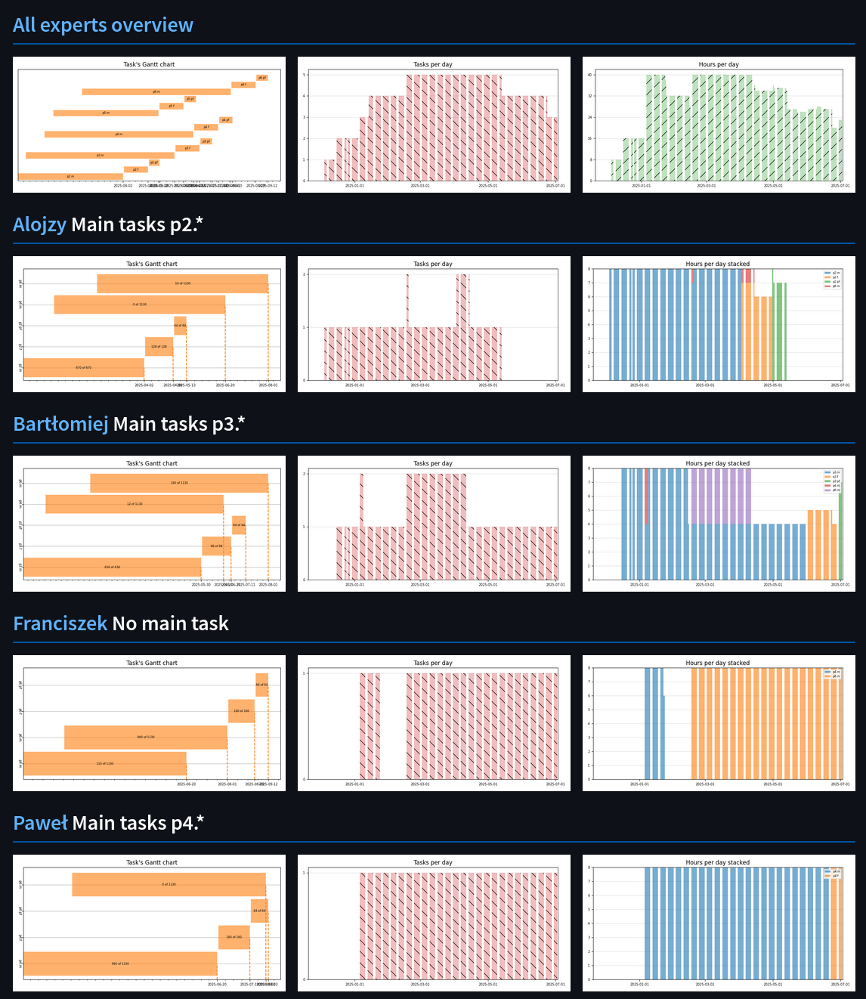
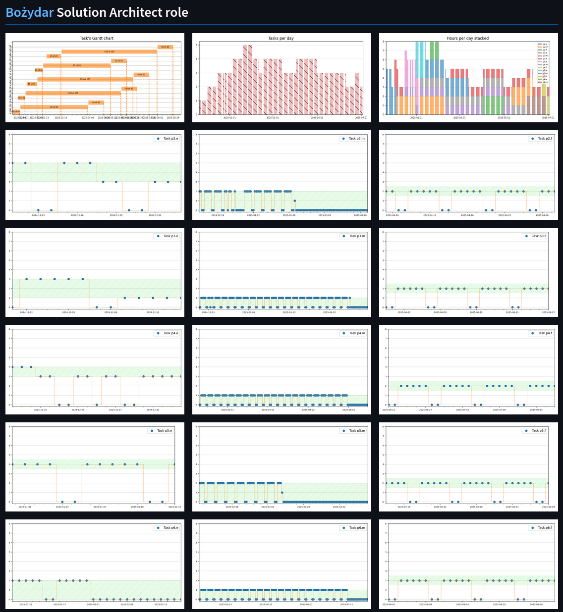
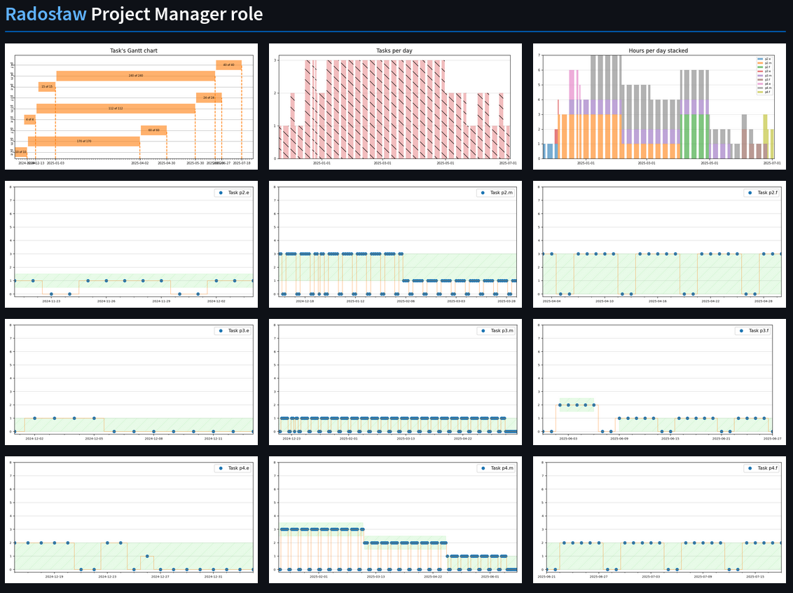
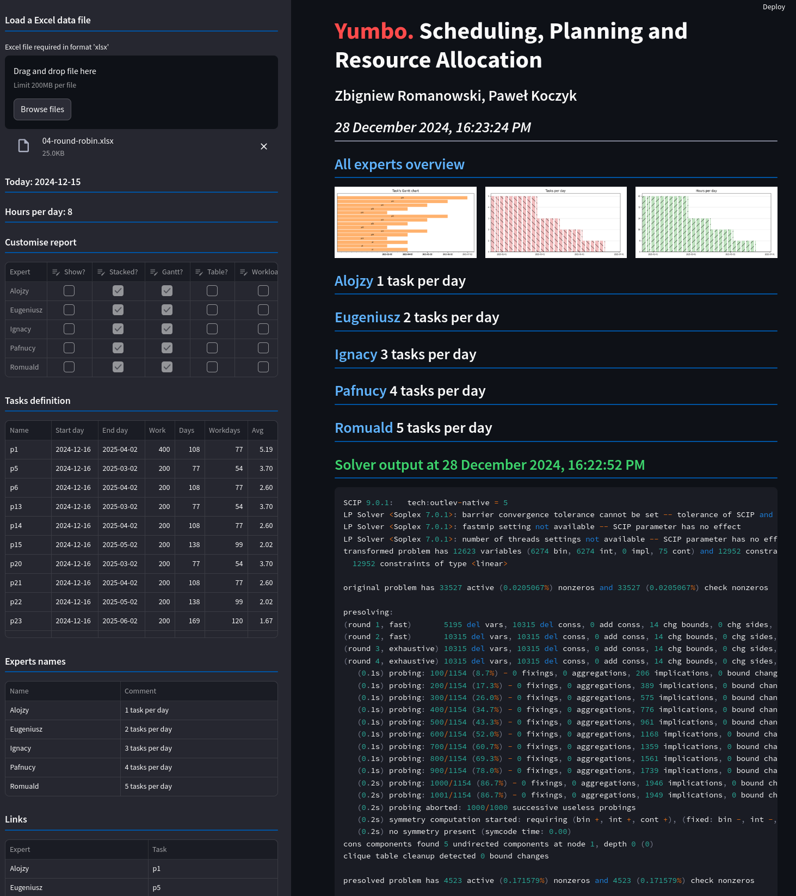

# Yumbo. Scheduling, Planning and Resource Allocation

## Authors: Zbigniew Romanowski; Paweł Koczyk; Jacek Pikul;

## Overview
Yumbo is a sophisticated scheduling and resource allocation tool aimed at project managers, solution architects, and other professionals managing multiple tasks or projects simultaneously. The software focuses on the optimal generation of daily schedules while adhering to business rules and constraints.

## Features
1. **Optimal Schedule Generation**:
   - Balances overlapping tasks and independent start/end dates.
   - Handles tasks with durations up to 200 working days (or more).
2. **Compliance with Business Rules**:
   - Ensures schedules meet working hour limits.
   - Considers expert availability, holidays, and public holidays.
3. **Flexible Planning Horizons**:
   - Supports both short-term and long-term planning.
   - Allows dynamic updates for changes in expert availability or task additions.
4. **Mathematical Modeling**:
   - Uses Mixed Integer Linear Programming (MILP) to create optimized schedules.
   - Encourages early task completion through the objective function.


## Mathematical Model
Yumbo models the scheduling problem as a linear mixed-integer problem using the following:
- **Task Properties**:
  - Start Date
  - End Date
  - Workload (in hours)
- **Constraints**:
  - Daily working hour limits.
  - Period-based working hour limits.
  - Task-specific daily working hour limits.
  - Employee-specific daily working hour limits.

The problem is solved using the AMPL language and the HiGHS solver.


## Technology Stack
Yumbo integrates various tools and libraries to ensure robust functionality and user experience:

- **Mathematical Modeling**:
  - AMPL: Mathematical programming language.
  - HiGHS: High-performance linear optimization solver.
  - SCIP: Non-commercial solver for mixed integer programming.
- **User Interface**:
  - Streamlit: Framework for building data-driven apps.
- **Data Processing and Visualization**:
  - Python: Core programming language.
  - Pandas: Data analysis and manipulation.
  - NumPy: Scientific computing.
  - Matplotlib: Static, animated, and interactive visualizations.


## Installation
1. Clone the repository:
   ```bash
   git clone https://github.com/romz-pl/yumbo.git
   cd yumbo
   ```
2. Install required Python libraries:
   ```bash
   pip install -r ./src/requirements.txt
   ```
3. Run the application:
   ```bash
   streamlit run ./src/main_yumbo.py
   ```


## Usage
- Input task details (start/end dates, workload, constraints).
- Generate daily schedules using the intuitive graphical user interface.
- Visualize and export schedules as needed.

## Streamlit Community Cloud
Yumbo is available on the Streamlit Community Cloud at https://yumbo-ampl.streamlit.app/


## Contributing
Contributions are welcome! Please follow these steps:
1. Fork the repository.
2. Create a feature branch:
   ```bash
   git checkout -b feature-name
   ```
3. Commit your changes:
   ```bash
   git commit -m "Description of changes"
   ```
4. Push the branch:
   ```bash
   git push origin feature-name
   ```
5. Submit a pull request.


## License
Yumbo is licensed under the [MIT License](LICENSE).


## Contact
For any inquiries or support, contact:
- Zbigniew Romanowski: [romz@wp.pl](mailto:romz@wp.pl)
- Paweł Koczyk: [pk@koczyk.pl](mailto:pk@koczyk.pl)


## Acknowledgments
This project utilizes the following open-source tools and frameworks:
- [AMPL](https://ampl.com/) a mathematical programming language; 
- [HiGHS](https://highs.dev/) a high performance software for linear optimization; 
- [SCIP](https://www.scipopt.org/) one of the fastest non-commercial solvers for mixed integer programming and mixed integer nonlinear programming;
- [Streamlit](https://streamlit.io/) a faster way to build and share data apps; 
- [Python](https://www.python.org/) a programming language that lets you work quickly; 
- [Pandas](https://pandas.pydata.org/) a fast, powerful, flexible and easy to use open source data analysis and manipulation tool; 
- [Matplotlib](https://matplotlib.org/) a comprehensive library for creating static, animated, and interactive visualizations in Python; 
- [NumPy](https://numpy.org/) the fundamental package for scientific computing with Python;


Thank you for using Yumbo! Your feedback and contributions are greatly appreciated.

## Screenshots











