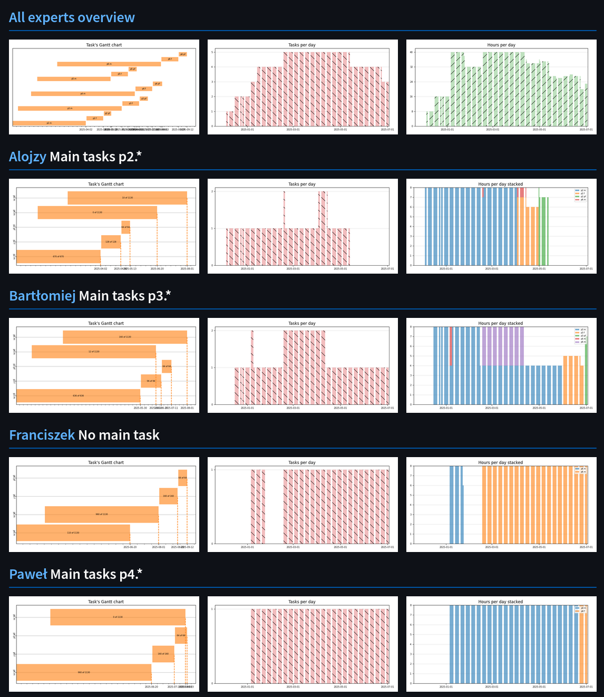
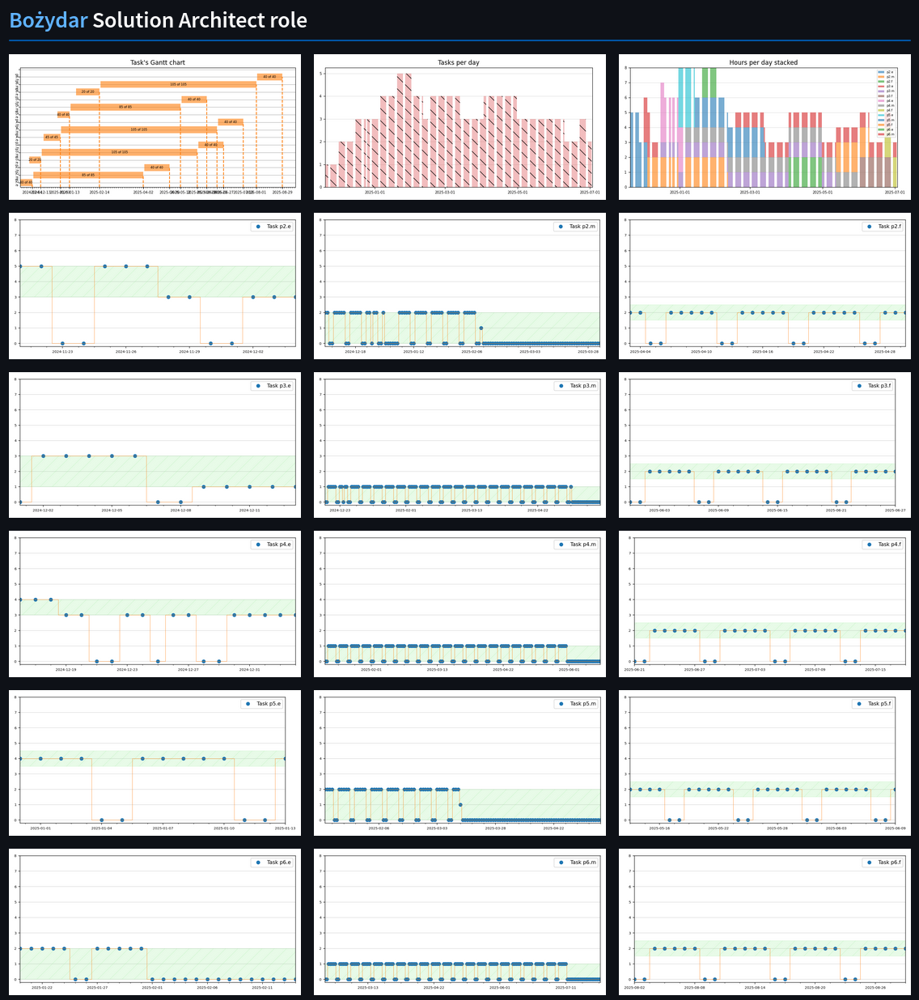
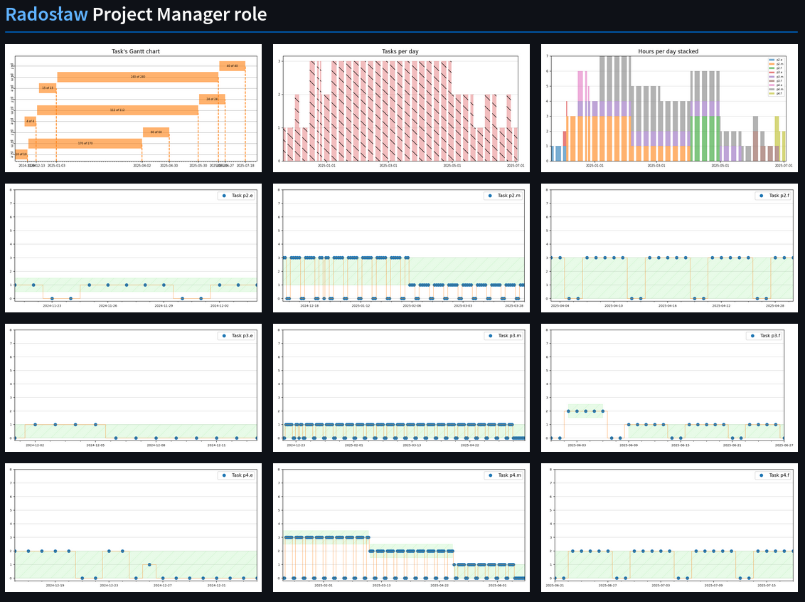
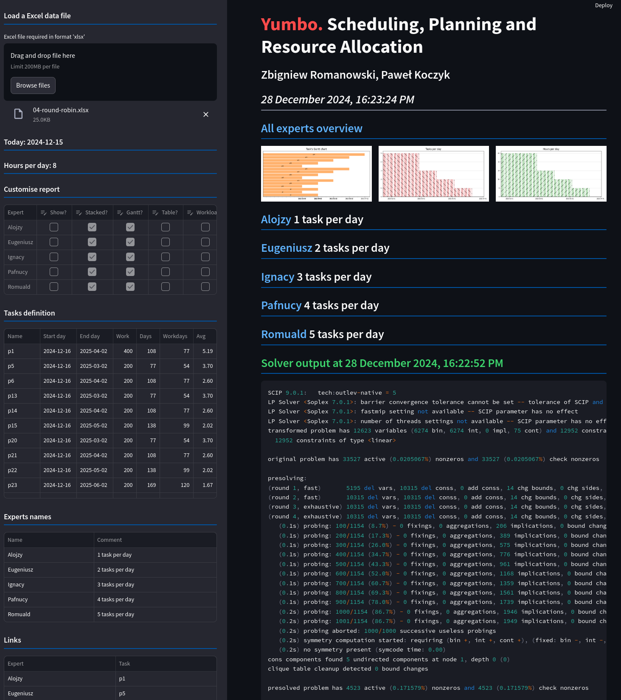
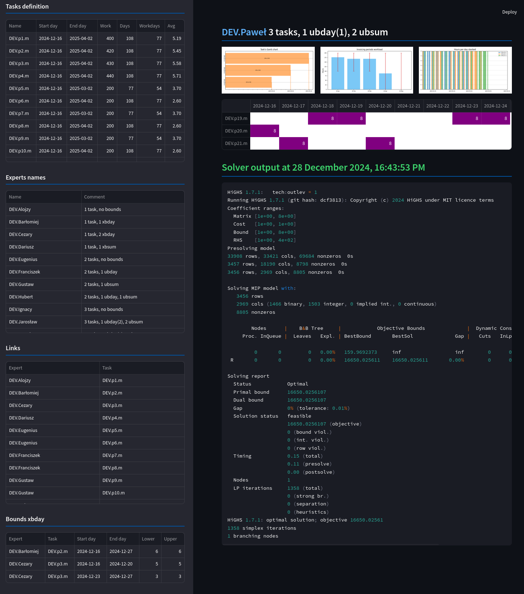

# 📅 Yumbo. Scheduling, Planning and Resource Allocation

Yumbo is a sophisticated scheduling and resource allocation tool aimed at project managers, solution architects, and other professionals managing multiple tasks or projects simultaneously. The software focuses on the optimal generation of daily schedules while adhering to business rules and constraints.

## Running system

The running system is available on the Streamlit Community Cloud, see https://yumbo-ampl.streamlit.app/

## Features
1. **Optimal Schedule Generation**:
   - Balances overlapping tasks and independent start/end dates.
   - Handles tasks with durations up to 200 working days (or more).
2. **Compliance with Business Rules**:
   - Ensures schedules meet working hour limits.
   - Considers expert availability, holidays, and public holidays.
3. **Flexible Planning Horizons**:
   - Supports both short-term and long-term planning.
   - Allows dynamic updates for changes in expert availability or task additions.
4. **Mathematical Modeling**:
   - Uses Mixed Integer Linear Programming (MILP) to create optimized schedules.
   - Encourages early task completion through the objective function.


## Mathematical Model
Yumbo models the scheduling problem as a linear mixed-integer problem using the following:
- **Task Properties**:
  - Start Date
  - End Date
  - Workload (in hours)
- **Constraints**:
  - Daily working hour limits.
  - Period-based working hour limits.
  - Task-specific daily working hour limits.
  - Employee-specific daily working hour limits.

The problem is solved using the AMPL language and the HiGHS solver.


## Technology Stack
Yumbo integrates various tools and libraries to ensure robust functionality and user experience:

- **Mathematical Modeling**:
  - AMPL: Mathematical programming language.
  - HiGHS: High-performance linear optimization solver.
  - SCIP: Non-commercial solver for mixed integer programming.
- **User Interface**:
  - Streamlit: Framework for building data-driven apps.
- **Data Processing and Visualization**:
  - Python: Core programming language.
  - Pandas: Data analysis and manipulation.
  - NumPy: Scientific computing.Yumbo solved the real case with 41 e
  - Matplotlib: Static, animated, and interactive visualizations.
 
## Yumbo's evolution. From Concept to Maturity

The important thing is that Yumbo has gone through the entire cycle of advanced software development and can now be treated as a mature program. Below is the chronological order of the development stages:
  - **The business problem has been identified!**
  - Natural language was used to formulate the business problem.
  - The process of formulating the business problem with a mathematical rigor has been set in motion.
  - To help formulate the problem, the tools of operations research were chosen.
  - **Linear programming was used to develop the first version of the mathematical model.**
  - The more precise version of the mathematical model using integer linear programming was proposed.
  - **The objective function that favors the early completion of the task was invented.**
  - Business requirements were incorporated into the mathematical model as integer linear problem constraints.
  - Constraints XBDAY, UBDAY, PBSUM, XBSUM, UBSUM were introduced to represent the requirements and expectations of the business.
  - A suitable name for the program was found. Yumbo was born!
  - Additional mathematical constraints (XBSUM and UBSUM) were proposed and implemented.
  - Designing schedules through the set of constraints was invented.
  - Focusing on constraints as a means to design flexible schedules has been the subject of in-depth analysis.
  - Integer linear mathematical model was implemented as AMPL program.
  - A text mode prototype running on the NEOS service has been created and tested extensively.
  - It has been observed that text mode is not sufficient for presenting complex constraints and schedules.
  - **The process of finding the right framework for building web applications suitable for our purpose began. Streamlit was chosen.**
  - A prototype of the application has been created with the help of the Streamlit framework.
  - **AMPL Python modules have been integrated into the program.**
  - Support for a HiGHS solver through AMPL Python modules has been implemented.
  - A json file was used to formulate the input data.
  - A Microsoft Excel was used as the input format, which provides extensive editing capabilities and allows for the validation of the input data.
  - The Pandas and Numpy libraries were used for the analysis of the data.
  - Extensive set of sample input data has been prepared as Excel files.
  - The complete source code of Yumbo has been moved to GitHub as an open source project under the MIT license.
  - A sophisticated reporting system was one of the requirements.
  - To generate high quality professional plots and charts, the matplotlib library was chosen.
  - Design and implementation of a sophisticated reporting system using the matplotlib library began.
  - User-friendly customization of the generated charts has been added.
  - To further customize the reporting system, a "Look and Fill" section has been added.
  - The st.columns object from the Streamlit framework has been in heavy use.
  - The testbed with increasing number of experts, tasks and constraints was prepared and run on Yumbo.
  - For some use cases, memory consumption as high as 14 GiB has been observed in the pre-solve phase of the AMPL engine.
  - The process of finding a model capable of finding a schedule with more than 3,000 experts, tasks, and constraints has begun.
  - **A memory efficient mathematical model was designed and implemented.**
  - Two mathematical models with different profiles of memory usage have been introduced: one with and one without UBDAY constraints.
  - The XBSUM and UBSUM constraints are not included in the mathematical model because they are rarely used in planning.
  - Added support for three open source solvers HiGHS, GCG, SCIP via AMPL Python modules.
  - The process of extensive testing with three solvers HiGHS, GCG, SCIP has begun.
  - It has been observed that many use cases have more than one schedule with the same value of the objective function.
  - The tests clearly showed that different solvers can produce different schedules with the same objective value.
  - Report in Streamlit framework is divided into sections: Problem, Summary, Experts, Tasks, Statistics, Model.
  - Further improvements to the reporting system were proposed and developed.
  - Data processing has been optimized for speed by using vectorized versions of functions from the Pandas and NumPy libraries.
  - Unified handling of the date data type by the Pandas library has been implemented.
  - Date format as "%Y-%m-%d" was enforced.
  - The program has been modularized and the modularization process has resulted in two sets of Python modules: img*, report*.
  - For further visualization improvements, the st.tabs and st.pills objects from the Streamlit framework were used.
  - **The Yumbo program is available as a WEB service on the Streamlit Community Cloud, https://yumbo-ampl.streamlit.app/.**
  - The mathematical model was extended by the introduction of "overflow tasks".
  - The overflowing task model enabled us to create a schedule for tasks with insufficient number of assigned experts to complete the tasks on time.
  - For performance reasons, the ax.bar function has been replaced by the ax.fill_between function from the matplotlib library.
  - For matplotlib charts, the image compression process has been optimized by using the WebP file format instead of PNG.
  - Session variables in the Streamlit framework were used to allow simultaneous multi-user program execution.
  - Caching system in Streamlit framework was used to speed up the second time process of image generation.
  - The hash of selected session variables was passed as a function argument to enforce correct caching system behavior in Streamlit.
  - The hashlib.md5 was replaced with hashlib.blake2s.
  - Convolution of sizes 7, 15, 21 has been implemented for the "Hours per day" chart in the summary section.
  - Export of the entire schedule to a compressed CSV file is implemented.
  - Further adjustment and refinement of the reporting system is required.
  - **Yumbo solved the real case with 41 experts, 282 tasks, 423 assignments and 186 XBDAY constraints in less than 3 minutes on moderate CPU and generated a complete report without any problems.**
  - More complex and involved input cases have been prepared.
  - The study of the behavior with the walking time has been under investigation.
  - The statistics for reporting the running time are implemented.
  - Validation of input data from Excel files has been implemented.
  - The caching process of generated images and tables has been improved and simplified.
  - Material icons have been used to improve the visual appeal of the reporting module.
  - The input data file generator has been implemented as an Excel spreadsheet.


## Installation
1. Clone the repository:
   ```bash
   git clone https://github.com/romz-pl/yumbo.git
   cd yumbo
   ```
2. Install required Python libraries:
   ```bash
   pip install -r ./src/requirements.txt
   ```
3. Run the application:
   ```bash
   streamlit run ./src/main_yumbo.py
   ```


## Usage
- Input task details (start/end dates, workload, constraints).
- Generate daily schedules using the intuitive graphical user interface.
- Visualize and export schedules as needed.

## Streamlit Community Cloud
Yumbo is available on the Streamlit Community Cloud at https://yumbo-ampl.streamlit.app/


## Authors: 
- Zbigniew Romanowski [romz@wp.pl](mailto:romz@wp.pl)
- Paweł Koczyk [pk@koczyk.pl](mailto:pk@koczyk.pl)
- Jacek Pikul


## Contributing
Contributions are welcome! Please follow these steps:
1. Fork the repository.
2. Create a feature branch:
   ```bash
   git checkout -b feature-name
   ```
3. Commit your changes:
   ```bash
   git commit -m "Description of changes"
   ```
4. Push the branch:
   ```bash
   git push origin feature-name
   ```
5. Submit a pull request.


## License
Yumbo is licensed under the [MIT License](LICENSE).


## Acknowledgments
This project utilizes the following open-source tools and frameworks:
- [AMPL](https://ampl.com/) a mathematical programming language; 
- [HiGHS](https://highs.dev/) a high performance software for linear optimization; 
- [SCIP](https://www.scipopt.org/) one of the fastest non-commercial solvers for mixed integer programming and mixed integer nonlinear programming;
- [Streamlit](https://streamlit.io/) a faster way to build and share data apps; 
- [Python](https://www.python.org/) a programming language that lets you work quickly; 
- [Pandas](https://pandas.pydata.org/) a fast, powerful, flexible and easy to use open source data analysis and manipulation tool; 
- [Matplotlib](https://matplotlib.org/) a comprehensive library for creating static, animated, and interactive visualizations in Python; 
- [NumPy](https://numpy.org/) the fundamental package for scientific computing with Python;


Thank you for using Yumbo! Your feedback and contributions are greatly appreciated.

## Screenshots











