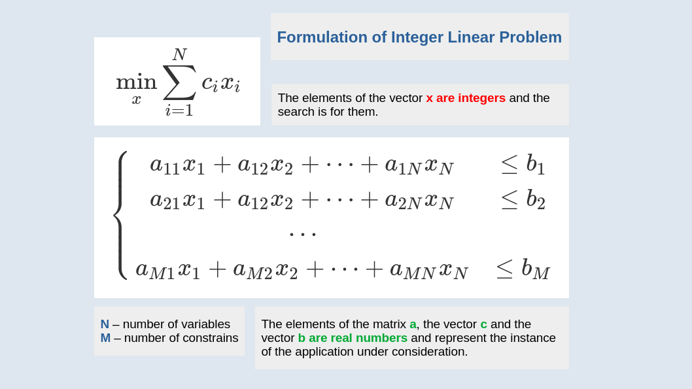

# Operations Research and Project Management

The field of project management is replete with applications of scheduling, which in turn gives rise to a plethora of intriguing and intricate mathematical problems. The **formulation of scheduling** can be approached in a number of different ways, with the specific mathematical formulation dependent on the details of the situation. Let us consider the case where an employee is assigned to one or more projects simultaneously, with the minimum amount of assigned working time being one hour. The objective is to identify a daily schedule that aligns with the specified business requirements and accommodates any necessary adjustments driven by customer needs.

As a **minimisation problem** that favours early task completion, this scheduling problem has been formulated as a mixed-integer linear problem. The formulation of the problem allows for both short- and long-term planning, which is essential for rational business decisions. The existence of a feasible solution to the problem indicates that a schedule can be devised which allows the imposed constraints to be met, and that there are sufficient human resources to complete the acquired tasks. In the event that the constraints on task completion are too tight or there are insufficient personnel, it is necessary to relax the business rules in order to identify a **feasible schedule**. The availability of a roadmap is of paramount importance, as it serves as the company's authorization to enter into new contractual agreements.

The solution to the formulated mathematical problem is a three-dimensional matrix, which is indexed by employees, days in the planning horizon and the task under consideration. Consequently, the number of variables in the search is equal to the product of the dimensions of the matrix. In formulating the problem, the business rules, customer requirements and labour law constraints have been expressed as **linear constraints**. It has been observed that the constraints are imposed on a near-daily basis, on every task and on every member of staff for the use cases that have been studied. Consequently, the number of constraints is almost equivalent to the number of variables under investigation. However, due to the distinctive structure of the problem, the number of searched variables and the number of constraints can be considerably reduced, resulting in a notable reduction in solution time.

You can find more about application of linear programming and operations research in the books:
+ F. Hillier, Gerald Lieberman [**Introduction to Operations Research**](https://www.mheducation.com/highered/product/Introduction-to-Operations-Research-Hillier.html)
+ R.J. Boucherie, A. Braaksma, H. Tijms [**Operations Research Introduction to Models and Methods**](https://www.utwente.nl/en/eemcs/sor/boucherie/Operations%20Research/)


```
#OperationsResearch
#DataScience
#Optimization
#ProjectManagement
```


