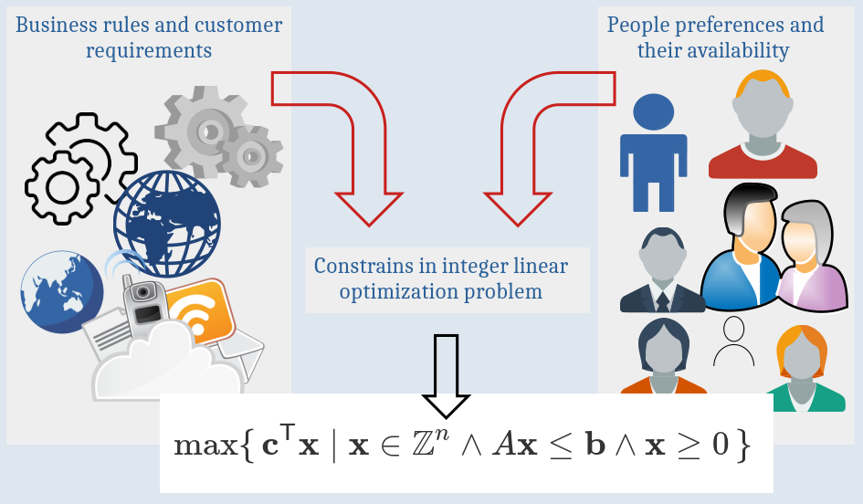

# Mathematical Model of the Scheduling Problem

The objective of scheduling is to identify a timetable that satisfies the constraints imposed by business and takes into account any human preferences. The scheduling problem is inherently complex due to the vast number of potential constraints and profiles. Consequently, numerous **mathematical formulations** have been proposed to address this challenge.

To provide a more detailed and accurate analysis, we will examine the issue of task assignment in greater depth. In this context, each employee can be assigned to one or more tasks concurrently, and each task can be assigned to one or more employees. In this case, a number of **business constraints** must be taken into account, including the expected lifetime of the task and the number of working hours required to complete it. In addition, there are the preferences and availability of the individuals involved in the project, such as their willingness to work on a single task for five consecutive days or their preference to be involved in precisely two specific tasks per day over the course of the next month.

It is essential to emphasise that the profile and **characteristics of the task** have a significant impact on the final timetable. To illustrate, consider the expert who is expected to be involved in the project for one hour per day. As a second example, one might consider the developer who will be involved in the project for eight hours per day until the arrival of the New Year.

The software used for scheduling and planning should be sufficiently flexible to accommodate the diverse characteristics of tasks and the varying preferences of individuals. The software we are developing employs a **mixed-integer linear programming algorithm**, whereby business rules and employee preferences are incorporated as linear constraints within the optimisation problem. The latest version of the software enables the definition of rules to limit the number of hours worked per day or the number of tasks assigned per day. Both of these can be expressed as linear constraints. The conversion of business rules into linear constraints has notable practical implications, as there are numerous stable and efficient solvers, such as CPLEX, Gurobi, HiGHS and scip, that can be utilised to address such problems.

For those who are interested in the application of integer linear programming to the solution of complex business problems, I recommend the book H.P. Williams [**Model Building in Mathematical Programming**](https://www.wiley.com/en-dk/Model+Building+in+Mathematical+Programming%2C+5th+Edition-p-9781118443330)

```
#OperationResearch
#DataScience
#MathematicalModeling 
#OptimizationAlgorithms 
#SchedulingProblems
```


