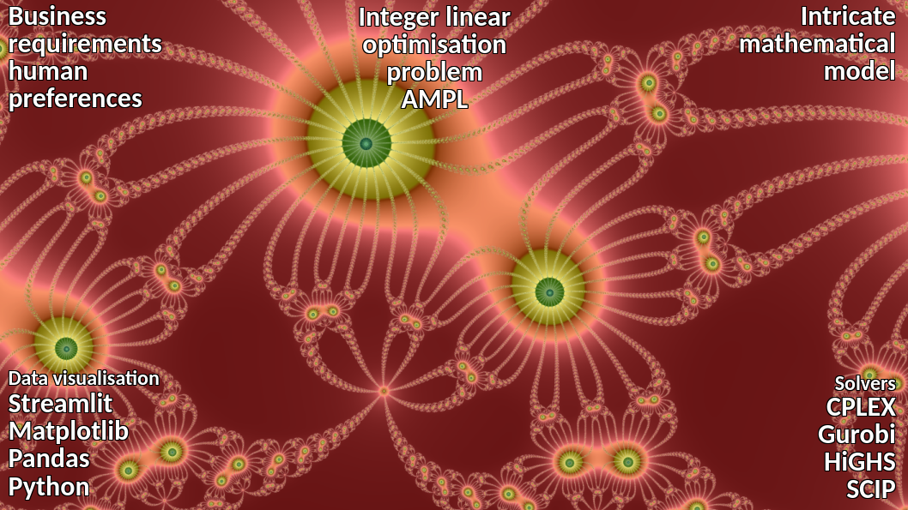

# Scheduling and timetable generation

The issue of timetable generation is a well-documented challenge in project management, also referred to as scheduling. A comprehensive review of the scheduling issue has enabled us to categorise it into more straightforward, clearly defined stages.

The initial phase is focused on understanding the **business requirements and human preferences**, which often requires a high level of knowledge and expertise. In accordance with the business requirements that have been defined, a **mathematical model** has been developed. In this instance, the intricate mathematical model has been converted into a mixed-integer linear optimisation problem, which has been deployed in the AMPL language. The AMPL framework enables us to utilise a range of solvers (including CPLEX, Gurobi, HiGHS and Scip) without making any modifications to the code.

Once the schedule has been obtained from the solver, which is presented as a tree-dimensional array of integers, the final stage, visualisation, can commence. To facilitate **data visualisation**, we utilise Streamlit, an interactive data dashboard that is perfectly suited to data scientists who wish to concentrate on analysis and presentation. For chart creation, the Matplotlib library was used, as it offers a comprehensive range of tools for creating static, animated, and interactive visualisations.

For **data exchange** and manipulation, we employ Pandas, an open-source library that provides high-performance, user-friendly data structures and data analysis tools. The entire programme has been developed in Python, a scripting language that offers both power and suitability for this purpose.

```
#OperationResearch
#DataScience
#Scheduling 
#MathematicalModel 
#Optimization
```


