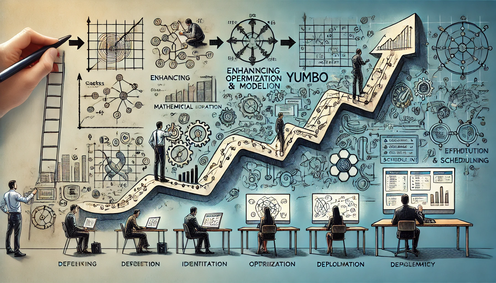

# 📅 Yumbo's evolution. From Concept to Maturity


The software development journey is one of continuous refinement - an iterative process of defining, optimizing, and implementing solutions to meet business needs. Yumbo is a prime example of this evolution, having undergone a full-cycle transformation from concept to mature system.

## Defining the problem
Every great piece of software starts with a well-defined problem. Yumbo's development began with the identification of a complex business challenge, first expressed in natural language and later refined into a mathematically rigorous formulation.

## Building the mathematical model
Operations research and linear programming provided the foundation for the first version of Yumbo's model. Over time, integer linear programming was introduced along with key constraints to capture essential business requirements.

## Enhancing optimization and scheduling
As the model evolved, the focus shifted to designing schedules through constraints to ensure flexibility and efficiency. The objective function was optimized to favor early task completion, further refining Yumbo's ability to generate optimal schedules.

## From prototype to full implementation
With a robust integer linear model in place, Yumbo was implemented in AMPL and tested in a text-based prototype via the [NEOS](https://neos-server.org/neos/) service. However, it became clear that text mode alone was not sufficient to effectively represent complex scheduling constraints. This led to the search for a suitable framework, culminating in the adoption of [Streamlit](https://streamlit.io/) for web-based deployment.

## Yumbo today: a mature and flexible solution
Through rigorous iteration, Yumbo has evolved into a sophisticated scheduling tool that uses advanced mathematical modeling to solve real-world business challenges. Its evolution demonstrates the power of structured problem solving, constraint-based optimization, and adaptive development methodologies.

As Yumbo continues to evolve, it serves as a testament to how software matures through research, iteration, and practical application. 

🔗 Yumbo is available as an open-source tool on [GitHub](https://github.com/romz-pl/yumbo/)


```
#OperationsResearch
#Optimization
#DataScience
#Streamlit
#Python
#AMPL
#LinearProgramming
```

Image created by ChatGPT.




Image created by ChatGPT.

