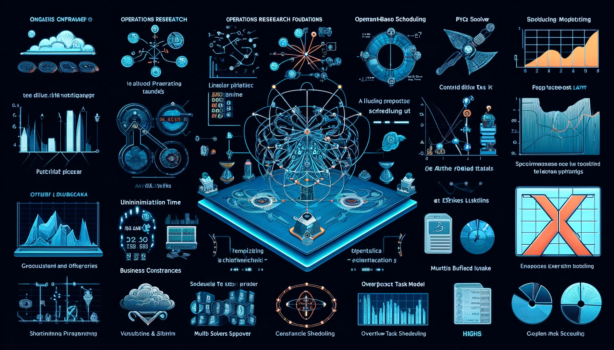

# 📅 Yumbo. Features of Mathematical Model


Designed to meet business needs for **efficient scheduling**, Yumbo is an advanced solution with a robust mathematical model that optimizes task scheduling with precision and flexibility. Let's take a closer look at its key features.

## Operations Research Foundations
The foundation of Yumbo’s mathematical model was laid with operations research techniques, ensuring that business problems were formulated with mathematical rigor.

## Linear Programming at the Core
The model was built from the ground up using linear programming, where the objective function was designed to favor early task completion, as required by managers.

## Incorporation of Business Constraints
To meet real-world scheduling needs, integer linear programming constraints were introduced to shape the scheduling logic and business requirements.

## Innovative Constraint-Based Scheduling
The program introduced a unique approach: designing schedules by focusing on constraints. This allowed for greater flexibility and adaptability to changing business needs.

## Implementation with AMPL and Python
Model was implemented using AMPL, integrating AMPL Python modules to enhance computational capabilities. 

## Scalability and Memory Efficiency
The design of the model focused on test cases with 1,000 experts, tasks, and constraints that required memory-efficient solutions. Two different models were introduced: one with and one without UBDAY constraints to provide different memory consumption profiles.

## Multi-Solver Support
Support for HiGHS, GCG, and SCIP solvers was added, streamlining efficient optimizations. An interesting finding was that different solvers often produced different schedules with identical objective function values.

## Overflow Task Model: A Breakthrough
A major enhancement was the introduction of overflow tasks model, which allowed the system to generate schedules even when the number of assigned experts was insufficient for timely task completion.


💡 As Yumbo **continues to evolve**, organizations can leverage its powerful mathematical optimization techniques to efficiently solve complex scheduling challenges. 

🔗 Yumbo is available as an **open-source tool** on GitHub https://github.com/romz-pl/yumbo/ and as ready-to-run system https://yumbo-ampl.streamlit.app/ .


```
#OperationsResearch
#Optimization
#DataScience
#Streamlit
#Python
#AMPL
#LinearProgramming
```

Image created by ChatGPT.





