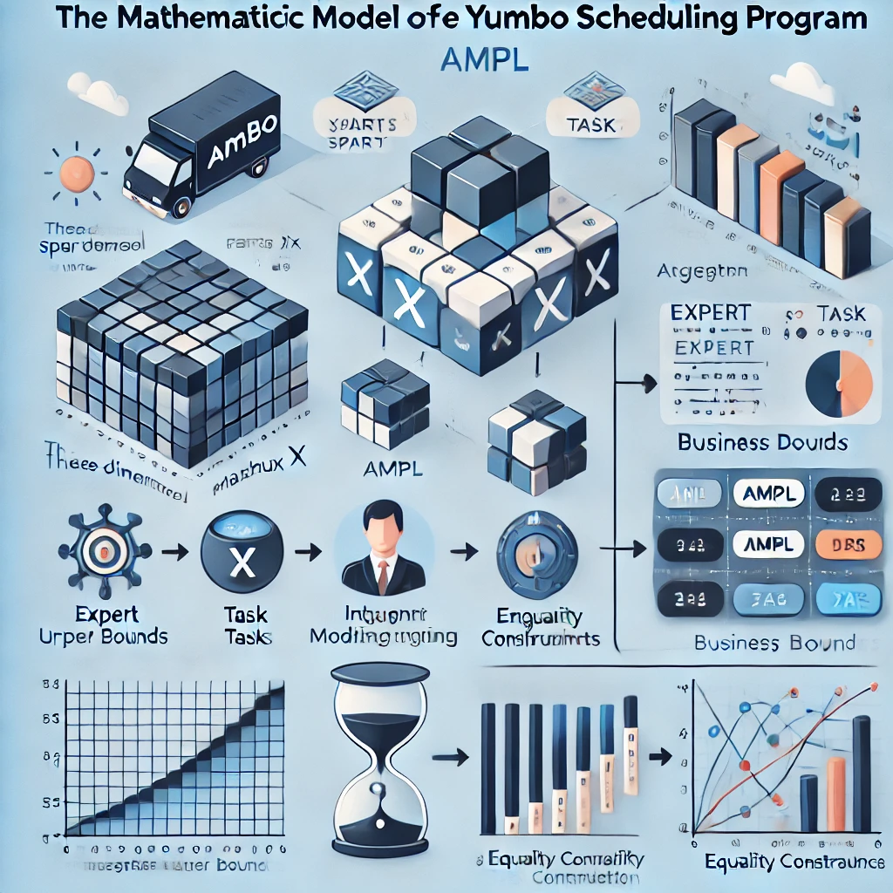

# 📅 Yumbo. Details of Mathematical Model


Yumbo is a computer program dedicated to the creation of schedules. It uses a **robust mathematical model** designed to generate optimal schedules. Let's take a closer look at the core structure and formulation behind it.

## Mathematical Foundation
Yumbo's model is implemented in **AMPL**, a powerful algebraic modeling language for optimization problems. At its core, the solution to the model is the schedule itself, represented as a three-dimensional sparse matrix X of integers.

## Matrix Representation
The matrix element **X[e,t,d]** defines the number of time units assigned to expert **e** for task **t** on day **d**. Since the smallest time unit in Yumbo is **15 minutes**, the matrix entries store values that are integer multiples of this unit.


## Business Logic
In Yumbo's mathematical model, only business days are included in the scheduling process. In addition, tasks duration are represented as ordered sequences of integers representing date differences. Other constraints ensure that work is assigned within defined time limits.


## Integer Linear Program
The scheduling problem is formulated as an integer linear program, which allows the use of a wide class of solvers. The objective function is a linear combination of matrix elements with increasing coefficients over time, which encourages early task completion.

## Constraint Management
The model incorporates five types of constraints, each parameterized to maintain business requirements. Four types of constraints define the lower and upper bounds on the specific days. The fifth one is the equality constraint which enforces that the work will be done. By balancing these constraints with an optimized objective function, Yumbo delivers efficient, structured schedules tailored to business needs.


💡 Through mathematical rigor and **optimization**, Yumbo transforms complex scheduling challenges into structured, actionable plans. This blend of AMPL-based modeling, integer programming, and constraints makes it a powerful tool for organizations seeking efficient scheduling solutions.

🔗 Yumbo is available as an **open-source tool** on GitHub https://github.com/romz-pl/yumbo/ and as the SaaS https://yumbo-ampl.streamlit.app/


```
#OperationsResearch
#Optimization
#DataScience
#Streamlit
#Python
#AMPL
#LinearProgramming
```

Image created by ChatGPT.





