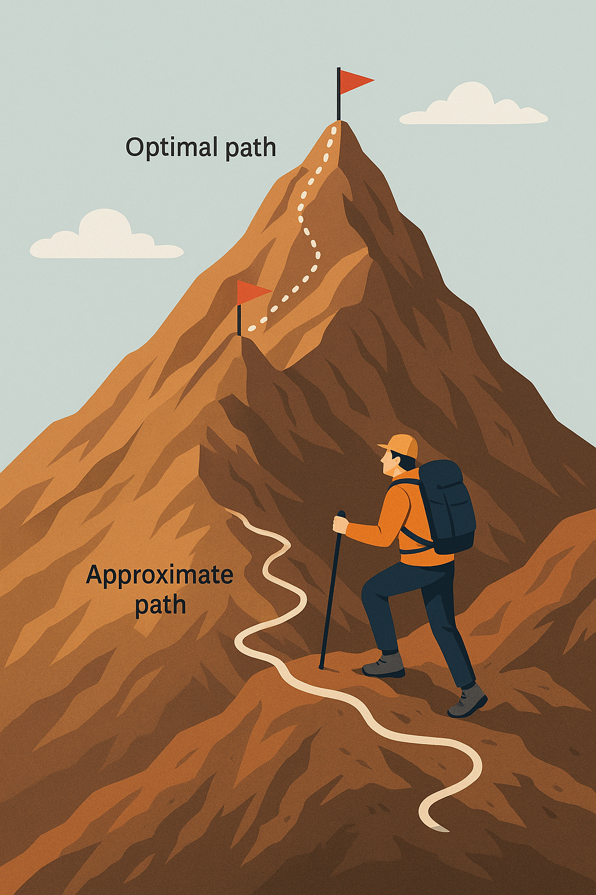

# Design and Analysis of Approximation Algorithms

As optimization problems in areas such as combinatorial optimization, bioinformatics, and communication networks become more complex, the need for practical, efficient solutions has never been greater. Yet many of these problems are provably intractable: we cannot compute exact solutions in polynomial time unless P=NP. This is where **approximation algorithms** play a critical role.

An approximation algorithm is designed to find a near-optimal solution efficiently, with a guaranteed performance ratio relative to the exact solution. Rather than pursuing exact answers at exponential cost, these algorithms strike a pragmatic balance: **good enough**, **fast enough**.

Since the emergence of NP-completeness theory, approximation algorithms have evolved from an academic curiosity to an **essential toolkit** for solving real-world problems. In fact, the last decades have seen an explosion of research in this area, fueled by the demands of emerging fields and a deeper theoretical understanding of computational complexity.

One of the most fascinating aspects of approximation algorithm design is the **dual focus** on performance: both running time and solution quality matter. This duality opens up a richer design space in which algorithmic strategies can be tuned according to the needs of the application: sometimes favoring speed, sometimes favoring closeness to the optimal.

Today's designers rely on powerful techniques such as greedy, **relaxation** and rounding, local search, and partitioning to meet these challenges. Each method has a different trade-off between efficiency and accuracy.

In addition, theoretical issues such as the existence of polynomial-time approximation schemes (PTAS) or fully polynomial-time approximation schemes (FPTAS) for certain problems remain vibrant research questions that touch on the deepest mysteries of computational theory.

💡 In short, approximation algorithms are no longer a compromise - they are **trategic solutions** that drive innovation in a world where exact computation is often out of reach.


## References
🔗 Ding-Zhu Du, Ker-I Ko, Xiaodong Hu **"Design and Analysis of Approximation Algorithms"**, 2012, https://doi.org/10.1007/978-1-4614-1701-9

🔗 David P. Williamson, David B. Shmoys **"The Design of Approximation Algorithms"**, 2011, https://doi.org/10.1017/CBO9780511921735


```
#OperationsResearch
#Optimization
#ApproximationAlgorithms
#Algorithms
#CombinatorialOptimization
#ComputationalTheory
```

Image created by ChatGPT.




