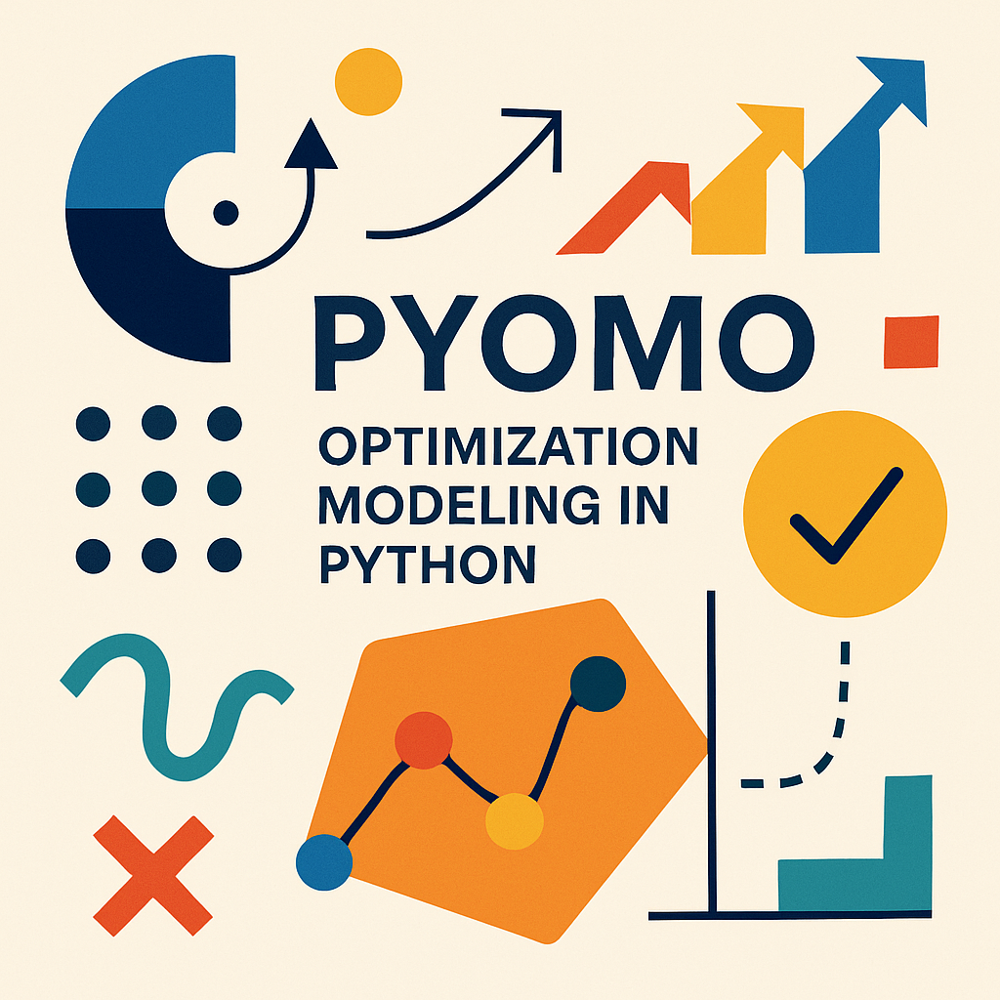

# Pyomo - Optimization Modeling in Python

In the ever-evolving world of Operations Research, the ability to efficiently model and solve complex **optimization problems** is a critical skill. Traditionally, commercial algebraic modeling languages (AMLs) such as AIMMS, AMPL, and GAMS have dominated the field. Today, Pyomo brings the same level of sophistication - and much more - to the open source Python ecosystem.

Pyomo (Python Optimization Modeling Objects) is a powerful, flexible software package that supports the definition and analysis of complex optimization models. What sets Pyomo apart is its deep integration with **Python** - a full-featured, high-level programming language with a wide range of supporting libraries. This synergy allows users not only to specify models with precision, but also to build complete analysis pipelines around them.

Optimization models are at the heart of **strategic decision** making. They help organizations explore trade-offs, understand extreme scenarios, and identify key drivers of performance. But building these models can be tedious and error-prone without the right tools, especially when communicating with different solver software packages that often lack standardization.

This is where high-level modeling languages like Pyomo shine. Pyomo provides a rich, expressive syntax for defining variables, constraints, goals, and complex structures such as sparse sets and indexed parameters. It **abstracts away** much of the complexity, allowing researchers and practitioners to focus on the business logic and science behind the models, not just the technicalities of solver communication.

In addition, Pyomo provides rigorous, solver-independent interfaces that make it easy to **swap solvers**, verify models, and automate large-scale optimization workflows, all within the familiar and versatile Python environment.


💡 As **optimization challenges** grow in scale and complexity, tools like Pyomo are essential to deliver insights that have real-world impact. Whether you are modeling supply chains, energy systems, financial portfolios, or machine learning pipelines, Pyomo gives you the tools you need to turn theoretical models into operational excellence.


 
## References
+ Pyomo web page, https://www.pyomo.org/
+ Pyomo GitHub repository, https://github.com/Pyomo/pyomo
+ M.L. Bynum, G.A. Hackebeil, W.E. Hart, C.D. Laird, B.L. Nicholson, J.D. Siirola, J.-P. Watson, D.L. Woodruff "Pyomo - Optimization Modeling in Python", 2021, https://doi.org/10.1007/978-3-030-68928-5
+ W.E. Hart, J.-P. Watson, D.L. Woodruff "Pyomo: Modeling and solving mathematical programs in Python" Mathematical Programming Computation, 3:219–260, 2011, https://doi.org/10.1007/s12532-011-0026-8


```
#OperationsResearch
#Optimization
#Pyomo
#Python
#CombinatorialOptimization
```

Image created by ChatGPT.




